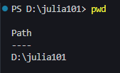
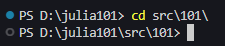
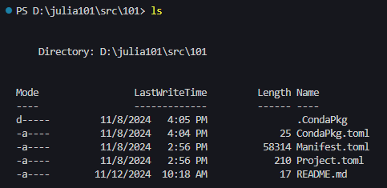
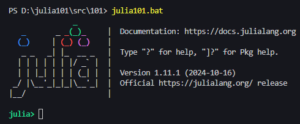

# Julia 101

Julia from zero to hero (for Scientific Computing)!

## First steps

Good! If you are reading this, you are probably using [VS Code](https://code.visualstudio.com/)! VS Code is Microsoft's open source text editor that has become the most popular editor in the past 5-6 years. It is portable (meaning it works in Windows, Linux, and Mac) and relatively light-weight (it won't use all you RAM as some proprietary tools would do). There are a few shortcuts you might want to keep in mind for using this tool in an efficient manner:

- `Ctrl+J`: show/hide the terminal
- `Ctrl+B`: show/hide the project tree
- `Ctrl+Shift+V`: display this file in rendered mode
- `Ctrl+Shift+P`: access the command pallete
- `Ctrl+K Ctrl+T`: change color theme
- `Alt+Z`: toggle column wrapping

## Command prompt

If this is you first time using the command prompt you might be interested by this section. The command prompt (often referred to as *terminal* in Linux world) is your interface to interact with the operating system and many available tools. To learn Julia it is useful to get a grasp of its use because it is there that we will launch Julia and other tools. It is assumed that you are working under Windows in what follows.

Let's use the shortcut to display the terminal `Ctrl+J`; the bottom of your window should display something as

The start of this line displays you *path* in the system; depending on your configuration that could not be the case and you can ask the OS to give you that with `pwd` (print working directory)

To start the course you are invited to move to the corresponding directory under the [src/](src/) folder; that implies you want to change directory, or `cd` in the system's language

Now that you reached your destination, you might be interested at inspecting the contents of this directory, *i.e.* listing its contents; that is done with `ls` as follows

Oops! It was not the directory you wanted to go to! No problems, you can navigate *one-level-upwards* using the special symbol `..` (two dots) and change directory again

Ok, this was for illustration only, let's get back to *101* and start working! Once there type `julia101` in the terminal and get a Julia prompt:

Please notice that this command `julia101` is a script written for simplifying this course at its early stages. In more advanced modules we will make use of `julia` executable directly.

A few more tips concerning the terminal:

- `Ctrl+L` gives you a clean terminal (also works inside Julia prompt)
- `Ctrl+D` breaks a program execution (*i.e.* use to quit Julia prompt)
- If you copied a command from a tutorial, you **CANNOT** use `Ctrl+V` to paste it into the terminal; in Windows simply right-click the command prompt and it will paste the copied contents.

This should be enough to start with! Now you can navigate to the selected course under [src/](src/) directory and start working.

## Coding practices

One of the reasons [Guido van Rossum](https://en.wikipedia.org/wiki/Guido_van_Rossum) created Python is because he wanted code to be readable. You should be able to guess what some code is doing even without specific technical knowledge about the language. This is probably the mean feature that made its creation so popular in the scientific world.

Although this course is all about Julia, we will stick to Python practices that are applicable to this language as described in the famous [PEP8](https://peps.python.org/pep-0008/). You should **read PEP8 religiously**. That document describes how to write clean and maintainable Python code. When transposing that to Julia, the minimum you are expected to do is:

- lines are limited to 79 characters
- use spaces around all operators
- consistent indentation with spaces
- blank lines around structural blocks
- lower case variable names
- Pascal-case structure names
- use underscore to separate words
- document functions properly

When you code, remember that most of the time what you are doing will be reviewed/used by somebody else and that person might not be in the mood to decypher the cryptic code you wrote; it that person is myself, **I will promptly refuse to help you** with badly written code. For newcomers, it is always better to talk about this before you write your first lines because once you stick to bad practices you will hardly ever leave them. Before you write something new, check if your ideas are also consistent with [PEP20](https://peps.python.org/pep-0020/).

Julia has its own [stylistic conventions](https://docs.julialang.org/en/v1/manual/variables/#Stylistic-Conventions) that are simpler than PEP8; the main differences are the way to name functions (it recommends to *glue* words and use no underscore) and the *exclamation mark !* indicating a function modifies it(s) argument(s). For function naming you may chose to stick to PEP8 recommendation, what is my personal choice. The detailed document is found [here](https://docs.julialang.org/en/v1/manual/style-guide/).

For [documenting code](https://docs.julialang.org/en/v1/manual/documentation/#Syntax-Guide) Julia has its own syntax which can be used to generate package documentation with help of [Documenter.jl](https://documenter.juliadocs.org/stable/)

**Important:** Julia supports [Unicode input](https://docs.julialang.org/en/v1/manual/unicode-input/), but its use is highly discouraged in modules. Unicode characters are better suited to write application scripts such as notebooks (in Pluto or Jupyter).

## Extensions

After testing the launch of the environment, the following extensions are recommended for following this course (they are not shipped with the distribution if you received a zip container with the materials):

- [Julia](https://github.com/julia-vscode/julia-vscode)
- [Julia Color Themes](https://github.com/CameronBieganek/julia-color-themes)

# Distribution

Download [7-zip](https://7-zip.org/download.html) archive and extract to a directory under [bin/]; check the value of `$zipDir` in [package.ps1](package.ps1) so that the executable is found in path and then run the script from a PowerShell terminal.
